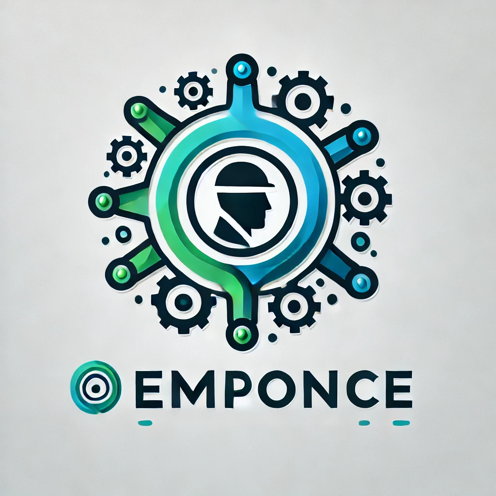

# EMPLEATRONIX_GGE



Una aplicación moderna y elegante para visualizar y gestionar datos de empleados de forma interactiva.

## 🚀 Características Principales

- 📊 Visualización de datos en tabla interactiva
- 📈 Gráfico de barras personalizable
- 🎨 Selector de colores para personalizar la visualización
- 👥 Opciones para mostrar/ocultar información
- 📱 Diseño responsive y amigable

## 📁 Estructura del Proyecto

```
empleatronix/
├── data/           # Datos de la aplicación
│   └── employees.csv
├── img/            # Recursos de imagen
│   └── logo.jpg
├── src/            # Código fuente
│   └── app.py
├── Dockerfile      # Configuración de Docker
├── docker-compose.yml
├── requirements.txt
└── README.md
```

## 🛠️ Requisitos

- Python 3.9+
- Docker (opcional)

## 🚀 Instalación y Ejecución

### 💻 Usando Python

1. Crear un entorno virtual:
   ```bash
   python -m venv venv
   source venv/bin/activate  # En Windows: venv\Scripts\activate
   ```

2. Instalar dependencias:
   ```bash
   pip install -r requirements.txt
   ```

3. Ejecutar la aplicación:
   ```bash
   streamlit run src/app.py
   ```

### 🐳 Usando Docker

1. Construir y ejecutar con Docker Compose:
   ```bash
   docker-compose up --build
   ```

La aplicación estará disponible en `http://localhost:8501`

## 🤝 Contribuir

Las contribuciones son bienvenidas. Por favor, siéntete libre de:

1. Fork el proyecto
2. Crear una rama para tu feature (`git checkout -b feature/AmazingFeature`)
3. Commit tus cambios (`git commit -m 'Add some AmazingFeature'`)
4. Push a la rama (`git push origin feature/AmazingFeature`)
5. Abrir un Pull Request
